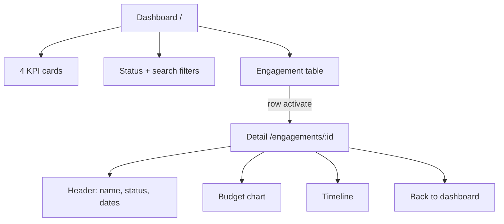
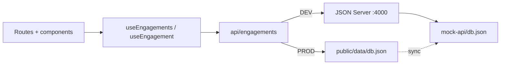
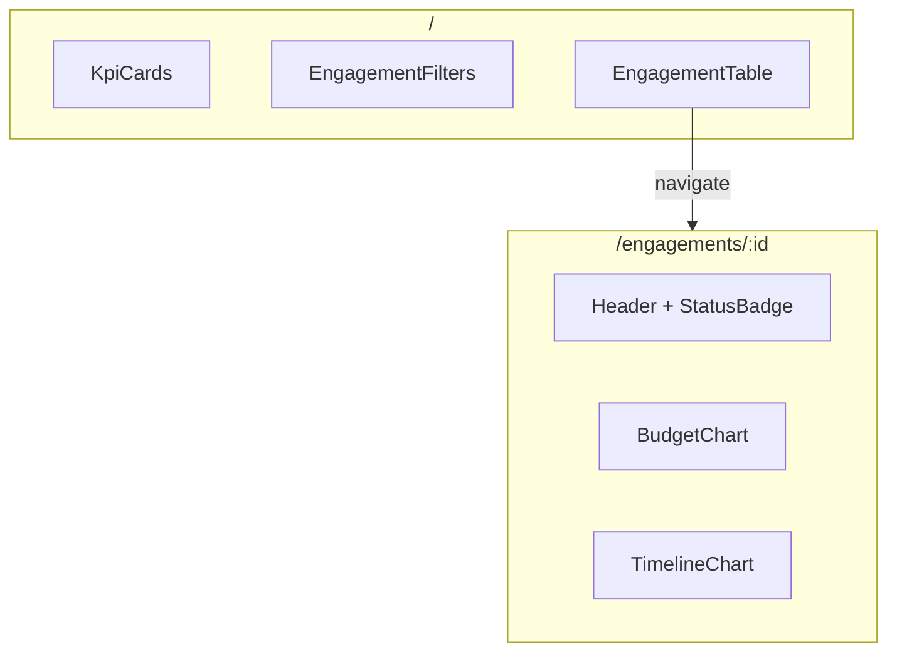

# Consulting KPI Dashboard - Plan

## Goal Capsule

- **Objective:** A hiring-portfolio consulting KPI dashboard where a reviewer can scan engagement health, filter the list, open a detail view with budget and timeline visuals, and use a live demo that works on desktop and mobile.
- **Means:** Local JSON Server mock HTTP + static mock for Vercel deploy; Bun scripts; dual-mode API client (KTD1).
- **Product authority:** Product Contract below; stretch items in Scope Boundaries are not active scope.
- **Open blockers:** None.
- **Execution profile:** Standard feature build on existing scaffold; unit-ordered commits.
- **Stop conditions:** Stop if live-demo static mock cannot preserve filter/search parity without reopening product scope.

---

## Product Contract

### Summary

Ship a two-route engagement KPI dashboard on the existing React scaffold: filtered list with four client-side KPIs, detail with budget vs actuals and timeline, accessible UI with loading/error/empty states, automated tests and CI, and a public live demo backed by a static mock while local development uses a mock HTTP API via Bun.

### Problem Frame

The scaffold is ready (React, Vite, TypeScript, MUI, TanStack Query/Router, Recharts, Vitest) but has no engagement domain, mock API, pages, CI, or portfolio README.
A portfolio reviewer needs a working live link and a Development Process section that shows real AI-assisted judgment, not a blank app shell.

### Key Decisions

- **Live demo uses a static mock of the same engagement shape** (session-settled: user-directed — chosen over hosted mock API or deferring the live link: simplest path to a working public demo). Governs R8, R9.
- **Local development uses a mock HTTP API; production does not require that process** (session-settled: user-directed — via choosing static mock for live). Governs R1, R8.
- **Bun is the package manager and script runner** (session-settled: user-directed — chosen over npm for json-server and local workflows). Governs R14.
- **Keep the scaffold router; product routes stay `/` and `/engagements/:id`** (session-settled: user-approved — confirmed after the TanStack Router vs react-router-dom call-out). Governs R4, R5.
- **No auth, custom backend, or realtime updates in MVP.** Governs Scope Boundaries.
- **Column sorting, CSV export, and theme toggle are stretch only.** Governs Scope Boundaries.

### Actors

- A1. Portfolio reviewer — opens the live demo, scans KPIs, filters, opens an engagement.
- A2. Local developer — runs Bun install/scripts, mock API, and app; extends and tests the UI.

### Key Flows

- F1. Scan and filter engagements
  - **Trigger:** Reviewer lands on `/`.
  - **Actors:** A1
  - **Steps:** App loads engagement list; four KPIs compute from the list; reviewer filters by status and/or search; table updates; empty filter set shows a centered empty message.
  - **Outcome:** Reviewer sees matching rows without a blank broken table.
  - **Covered by:** R2, R3, R4, R6, R7

- F2. Open engagement detail
  - **Trigger:** Reviewer activates a table row (click or keyboard Enter).
  - **Actors:** A1
  - **Steps:** Navigate to `/engagements/:id`; show client name, status, date range; show budget chart and timeline; back control returns to dashboard.
  - **Outcome:** Reviewer understands budget vs actuals and milestone progress for one engagement.
  - **Covered by:** R5, R6, R7

- F3. Recover from load failure
  - **Trigger:** Engagement fetch fails.
  - **Actors:** A1
  - **Steps:** Error alert appears with a retry control that refetches.
  - **Outcome:** Reviewer can recover without refreshing the whole app.
  - **Covered by:** R6



### Requirements

**Data and list behavior**

- R1. Local development loads engagements over real HTTP/JSON from a mock API (list, status filter, name search, single-by-id).
- R2. Engagements expose id, client name, status (`active` | `at_risk` | `completed`), budget, actuals, hours logged, percent complete, start/end dates, and a timeline of dated milestones with complete flags.
- R3. Mock dataset includes 6–8 engagements spanning `active`, `at_risk`, and `completed` so filters have meaningful results.
- R4. Dashboard at `/` shows four KPIs computed from the fetched list (Total Active, Total Budget, At Risk count, Avg % Complete), filters (status + debounced search), and a table of the filtered set; row activation navigates to detail.
- R5. Detail at `/engagements/:id` shows client name, status badge, date range, budget-vs-actuals chart, timeline (completed vs pending visually distinct), and a back control to the dashboard.

**States and accessibility**

- R6. Loading uses skeleton placeholders (not spinners); errors use an error alert with retry that refetches; empty filter results use a centered message (not a blank table).
- R7. Accessibility is required: KPI cards expose a single screen-reader label for value+label; table uses a real table with column headers (`scope="col"`) and keyboard-reachable row activation; filter controls have associated labels; icon-only controls have `aria-label`.

**Live demo parity**

- R8. The live deploy serves engagement data from a static mock of the same shape; no separate mock-API process is required in production.
- R9. Status filter and client-name search behave the same on the live demo as locally (behavioral parity), even if the transport differs.

**Quality, docs, and tooling**

- R10. Automated tests cover core components, list fetch success, and dashboard KPI computation from mock data (about 6–10 tests); prefer role-based queries over test IDs for table interactions.
- R11. CI on push and pull request runs lint, test, and build.
- R12. README covers what it is, tech stack, local run, Development Process (AI assistance with at least one concrete generated-code fix), testing/CI, and the live demo link.
- R13. Definition of done: public repo, clean history, live link works on desktop and mobile, tests pass in CI, no production console errors/warnings, Lighthouse accessibility ≥ 90.
- R14. Local install and scripts (including the mock API) use Bun; README documents Bun commands.

### Acceptance Examples

- AE1. Filter to active
  - **Covers R3, R4, R9.**
  - **Given:** Dataset includes active and non-active engagements.
  - **When:** Reviewer selects status `active`.
  - **Then:** Only active engagements appear; KPI cards recompute from the current fetched/filtered set as defined for the dashboard.

- AE2. Search by partial client name
  - **Covers R1, R4, R9.**
  - **Given:** An engagement named like "Northwind Retail Group" exists.
  - **When:** Reviewer types a partial case-insensitive match (e.g. "north").
  - **Then:** Matching rows appear after debounce; non-matches do not.

- AE3. Empty filter result
  - **Covers R6.**
  - **Given:** No engagement matches the current filters.
  - **When:** Filters are applied.
  - **Then:** A centered empty message is shown instead of an empty table body alone.

- AE4. Keyboard open detail
  - **Covers R5, R7.**
  - **Given:** Focus is on a table row.
  - **When:** Reviewer presses Enter.
  - **Then:** App navigates to that engagement's detail route.

- AE5. Fetch error retry
  - **Covers R6.**
  - **Given:** The list request fails.
  - **When:** Reviewer activates Retry.
  - **Then:** The app refetches; on success the dashboard content replaces the error alert.

- AE6. Live demo without mock API process
  - **Covers R8, R9.**
  - **Given:** The deployed app is opened with no local mock API running.
  - **When:** Reviewer filters and opens a detail page.
  - **Then:** Data loads from the static mock and filter/detail behavior matches local expectations.

### Success Criteria

- Live demo URL works on desktop and mobile without a separate API process.
- CI green on lint, test, and build.
- Lighthouse accessibility score ≥ 90 on the live app.
- README Development Process names at least one concrete AI-generated defect and the fix applied.
- Production build shows no console errors or warnings during normal dashboard and detail use.

### Scope Boundaries

**In scope:** Mock HTTP API for local; static mock for live; engagement types and list/detail UX; a11y states; tests; CI; README; public deploy; scaffold test harness + ThemeProvider + wire `styled-over-sx`; gate router devtools in production.

**Deferred for later (stretch):** `refetchInterval` "live" polling; CSV export; theme toggle; table column sorting.

**Outside this product's identity:** Custom backend, WebSockets, authentication, multi-user or write/edit flows.

### Dependencies / Assumptions

- Existing scaffold (React, Vite, TypeScript, MUI, TanStack Query, TanStack Router, Recharts, Vitest) remains the base.
- Hosting is Vercel static SPA (planning default for unanswered call-out).
- "Avg % Complete" and other KPIs are computed client-side from the engagement list returned for the current view/fetch as specified in R4.
- Product Contract preservation: unchanged R/A/F/AE IDs; Scope Boundaries expanded only for scaffold hygiene required by R10/R13.

### Outstanding Questions

**Resolve Before Planning:** None.

**Deferred to implementation:**

- Exact debounce ms for search (suggest 300ms).
- Concrete screenshot/GIF capture for README.

### Sources / Research

- User implementation spec v2; ce-brainstorm Product Contract.
- Repo research: TanStack file routes; QueryClientProvider in `src/providers/query.tsx`; Vitest currently `node` + `*.test.ts` only; no ThemeProvider; `styled-over-sx` unwired; no CI; eslint expects `src/constants/*`.

---

## Planning Contract

### Key Technical Decisions

- KTD1. **Dual-mode engagement API in one module** — In development, call JSON Server with query params (`status`, `clientName_like`, `/:id`). In production, `GET` static JSON from `public/data/db.json` and apply the same filters client-side. Chosen over always client-filtering (keeps real HTTP query practice locally) and over a hosted mock API (settled out). Instantiates R1, R8, R9.
- KTD2. **Single source of truth for mock data** — Author `mock-api/db.json` (6–8 engagements); copy or sync the same payload to `public/data/db.json` for the static deploy. Chosen over divergent datasets.
- KTD3. **Host on Vercel as a static SPA** — Default for unanswered call-out; SPA rewrite to `index.html` for client routes. Chosen over GitHub Pages / Netlify for Vite+Bun familiarity.
- KTD4. **Test doubles via mocked `fetch` + Testing Library** — Prefer `vi.fn` / stubbed `fetch` over MSW for MVP setup cost. Instantiates R10.
- KTD5. **Wire `styled-over-sx` into app ESLint** — Register the existing custom rule so MUI `sx` with >2 properties must use `styled`. Chosen over leaving the rule dead.
- KTD6. **Expand Vitest to jsdom + `*.test.{ts,tsx}`** before component tests — current config only runs `*.test.ts` in `node`.
- KTD7. **Bun for CI and scripts** — `oven-sh/setup-bun`, `bun install --frozen-lockfile`, `bun run lint|test|build`. Instantiates R11, R14.
- KTD8. **Gate `TanStackRouterDevtools` behind `import.meta.env.DEV`** — avoids production console noise (R13).

### Assumptions

- Unanswered Phase 5.1.5 call-outs accepted as KTD3–KTD5 defaults.
- Port `4000` for JSON Server; `VITE_API_URL=http://localhost:4000` in `.env.development`.
- `bun run dev:all` (concurrently) is preferred; README also documents two-terminal run.
- KPI cards compute from the list returned by the current filtered fetch (server- or client-filtered), not from an unfiltered second request.

### High-Level Technical Design





### Output Structure

```text
mock-api/db.json
public/data/db.json
.env.development
.env.example
.github/workflows/ci.yml
src/
  types/engagement.ts
  constants/api-endpoints.ts
  constants/query-keys.ts
  api/engagements.ts
  api/hooks.ts
  api/kpi.ts
  providers/theme.tsx
  components/
    Layout.tsx
    KpiCard.tsx
    StatusBadge.tsx
    EngagementFilters.tsx
    EngagementTable.tsx
    BudgetChart.tsx
    TimelineChart.tsx
  routes/
    __root.tsx          # ThemeProvider + Layout + DEV-only tools
    index.tsx           # DashboardPage
    engagements/$id.tsx # DetailPage
  __tests__/            # or colocated *.test.tsx
```

### System-Wide Impact

- **Reviewers (A1):** new UX surfaces and live URL.
- **Developers (A2):** Bun scripts, mock-api process, stricter MUI lint, jsdom tests.
- **CI:** new workflow; `prebuild` already chains typecheck/lint/test.

### Implementation Sequence

1. U1 mock data + scripts + env
2. U2 types/API/hooks (depends U1)
3. U3 harness + theme + eslint + root shell (parallelizable with U2 after U1 data exists for fixtures)
4. U4 presentational components + tests (depends U3)
5. U5 dashboard + detail pages (depends U2, U4)
6. U6 CI + README + Vercel deploy notes (depends U5 tests green)

---

## Implementation Units

### U1. Mock data, JSON Server, and env

- **Goal:** Local mock HTTP API and production static JSON share one engagement dataset.
- **Requirements:** R1, R2, R3, R8, R14; KTD1, KTD2
- **Dependencies:** None
- **Files:**
  - Create: `mock-api/db.json`, `public/data/db.json`, `.env.development`, `.env.example`
  - Modify: `package.json` (add json-server, optional concurrently; scripts mock-api, dev:all)
- **Approach:**
  1. Author 6-8 engagements with mixed statuses and timelines per R2/R3.
  2. Sync identical payload to `public/data/db.json`.
  3. Script mock-api: json-server --watch mock-api/db.json --port 4000 via Bun.
  4. Document VITE_API_URL=http://localhost:4000.
- **Patterns to follow:** Bun scripts in package.json; bun add -d.
- **Test scenarios:**
  - Test expectation: none -- data/config scaffolding; verified by U2 fetch tests and manual bun run mock-api.
- **Verification:** bun run mock-api serves GET /engagements and GET /engagements/:id; public/data/db.json present.

### U2. Types, dual-mode API client, and Query hooks

- **Goal:** Typed fetch layer with DEV HTTP query params and PROD static + client filter parity.
- **Requirements:** R1, R2, R8, R9; KTD1
- **Dependencies:** U1
- **Files:**
  - Create: src/types/engagement.ts, src/constants/api-endpoints.ts, src/constants/query-keys.ts, src/api/engagements.ts, src/api/hooks.ts, src/api/kpi.ts, src/api/engagements.test.ts
- **Approach:**
  1. Define EngagementStatus, TimelineEvent, Engagement, EngagementFilters per R2.
  2. fetchEngagements / fetchEngagementById: DEV uses JSON Server URL + params; PROD fetches /data/db.json and filters (status exact; clientName case-insensitive substring).
  3. Hooks useEngagements(filters), useEngagement(id) with enabled !!id; query keys in constants.
  4. Pure computeDashboardKpis for Total Active, Total Budget, At Risk count, Avg percent Complete.
- **Patterns to follow:** src/providers/query.tsx; @/ imports; import type; logger not console.
- **Test scenarios:**
  - Happy path: mocked fetch returns list; fetchEngagements resolves data.
  - Filter: status active and search north apply in PROD client-filter path.
  - Error: non-OK response throws.
  - Covers AE1/AE2 at API parity level.
- **Verification:** bun run test includes engagements API tests green.

### U3. Test harness, theme, ESLint rule, and root shell

- **Goal:** Enable React Testing Library tests and production-safe app shell.
- **Requirements:** R7, R10, R13; KTD4, KTD5, KTD6, KTD8
- **Dependencies:** None
- **Files:**
  - Modify: vite.config.ts, eslint.config.js, src/routes/__root.tsx, package.json
  - Create: src/providers/theme.tsx, src/components/Layout.tsx, src/test/setup.ts
- **Approach:**
  1. Vitest environment jsdom; include src/**/*.test.{ts,tsx}; jest-dom setup.
  2. Wire es-lint-custom-rules styled-over-sx for src.
  3. ThemeProvider + CssBaseline; Layout with AppBar, nav, main landmark.
  4. TanStackRouterDevtools only when import.meta.env.DEV.
- **Patterns to follow:** src/providers/query.tsx; es-lint-custom-rules/.
- **Test scenarios:**
  - Layout exposes main landmark via role query.
- **Verification:** bun run lint and Layout smoke test pass.

### U4. Presentational components

- **Goal:** Reusable UI building blocks with a11y and unit tests.
- **Requirements:** R4, R5, R6, R7, R10
- **Dependencies:** U3
- **Files:**
  - Create: src/components/KpiCard.tsx, StatusBadge.tsx, EngagementFilters.tsx, EngagementTable.tsx, BudgetChart.tsx, TimelineChart.tsx (+ *.test.tsx)
- **Approach:**
  1. KpiCard with combined aria-label; StatusBadge Chip colors; EngagementFilters labeled Select+TextField with debounce; EngagementTable real table, th scope=col, keyboard Enter; Recharts budget/timeline.
  2. Use styled when sx would exceed 2 properties.
- **Patterns to follow:** MUI + Emotion; @/ imports.
- **Test scenarios:**
  - KpiCard aria-label; StatusBadge per status; Filters callbacks; Table rows/click/Enter via getByRole row.
  - Covers AE4 at component level.
- **Verification:** Component tests pass under bun run test.

### U5. Dashboard and detail routes

- **Goal:** Wire pages to hooks with loading/error/empty states and navigation.
- **Requirements:** R4, R5, R6, R7, R9; F1-F3; AE1-AE6
- **Dependencies:** U2, U4
- **Files:**
  - Modify: src/routes/index.tsx
  - Create: src/routes/engagements/$id.tsx; dashboard/detail tests
- **Approach:**
  1. Dashboard: KPI row, filters, table; navigate on row activate.
  2. Detail: useEngagement(id); header, charts, back to /.
  3. Skeleton / Alert+Retry / empty message states.
  4. Let Vite plugin regenerate routeTree.gen.ts.
- **Patterns to follow:** createFileRoute in src/routes/index.tsx.
- **Test scenarios:**
  - Covers AE1: KPIs from mock list.
  - Covers AE3: empty filter message.
  - Covers AE5: Retry refetches.
  - Detail renders name/status on success.
- **Verification:** Manual smoke with mock-api + dev; page tests green.

### U6. CI, README, and live deploy

- **Goal:** Green CI, portfolio README, and Vercel live URL.
- **Requirements:** R11, R12, R13, R14; KTD3, KTD7
- **Dependencies:** U5
- **Files:**
  - Create: .github/workflows/ci.yml
  - Modify: README.md
- **Approach:**
  1. CI: setup-bun, bun install --frozen-lockfile, lint, test, build.
  2. README sections per R12/R14 with concrete AI Development Process fix.
  3. Deploy to Vercel with SPA fallback; production uses /data/db.json.
  4. Lighthouse a11y >= 90; no production console errors.
- **Test scenarios:**
  - Test expectation: none -- ops/docs; verified by CI and live smoke (AE6).
- **Verification:** CI green; live URL works desktop/mobile; README complete.

---

## Verification Contract

| Gate                 | Command / check                                     | Applies              |
| -------------------- | --------------------------------------------------- | -------------------- |
| Unit/component tests | `bun run test`                                      | After U2-U5          |
| Lint                 | `bun run lint`                                      | Continuous; CI       |
| Types                | `bun run check-types`                               | Continuous; prebuild |
| Production build     | `bun run build`                                     | Before deploy; CI    |
| Local mock API       | `bun run mock-api` + `bun run dev`                  | Manual U5 smoke      |
| CI                   | Push/PR workflow                                    | U6                   |
| A11y                 | Lighthouse >= 90 on live URL                        | U6 / DoD             |
| Live parity          | Open deployed app without mock-api; filter + detail | AE6                  |

Behavioral skill eval: not required (no agent surface).

---

## Definition of Done

**Global**

- [ ] All U1-U6 complete; abandoned experiment code removed from the diff
- [ ] `bun run lint`, `bun run test`, `bun run build` pass locally and in CI
- [ ] Live Vercel URL works on desktop and mobile without JSON Server
- [ ] Filter/search/detail parity on live demo (R8/R9)
- [ ] README Development Process names one concrete AI-generated fix
- [ ] No production console errors/warnings on normal flows; router tools gated DEV-only
- [ ] Lighthouse accessibility >= 90
- [ ] Public repo with clean commit history

**Per unit**

- U1: mock-api serves data; public/data/db.json synced
- U2: dual-mode API + hooks tested
- U3: jsdom RTL + ThemeProvider + styled-over-sx wired + DEV-only tools
- U4: component tests for card/badge/filters/table
- U5: dashboard + detail with states; KPI/page tests
- U6: CI + README + live link
